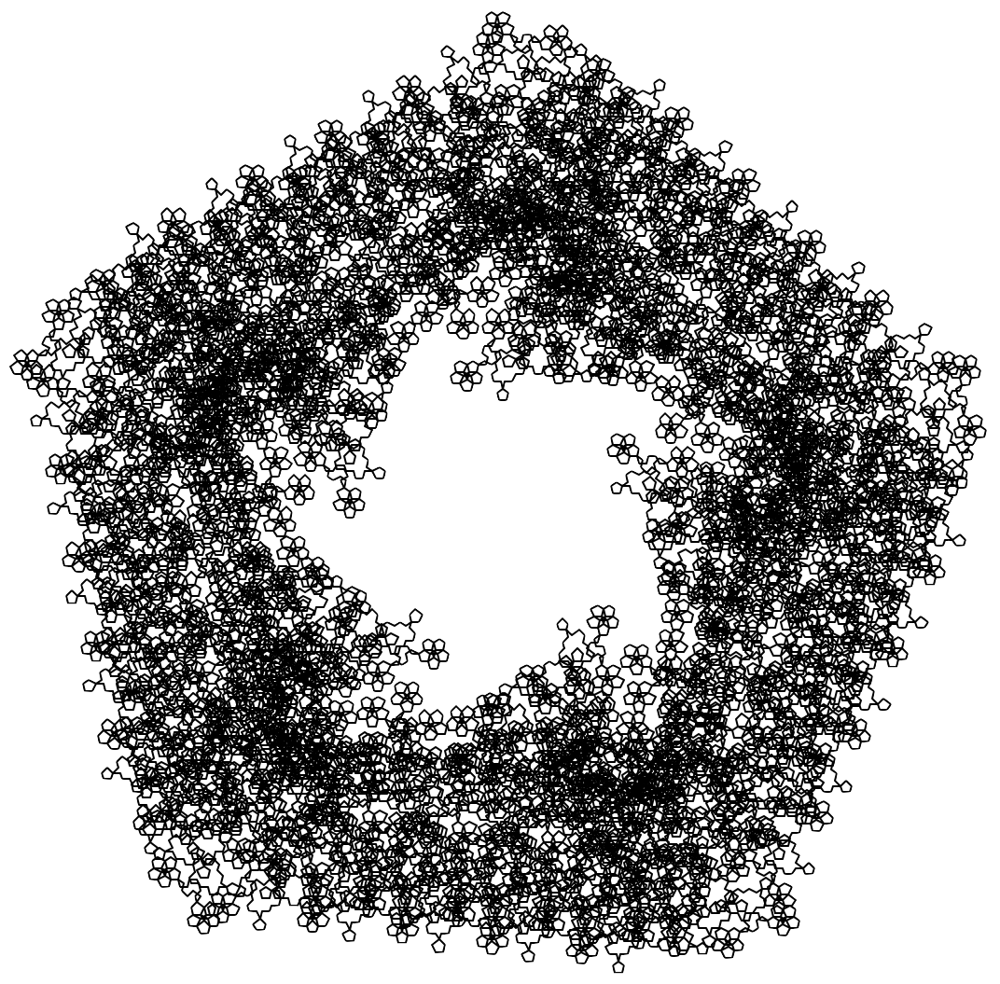
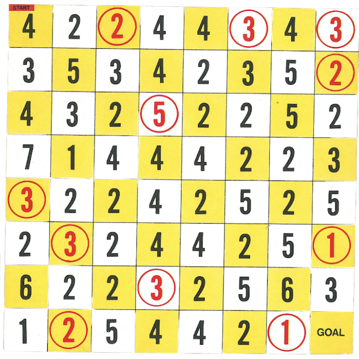
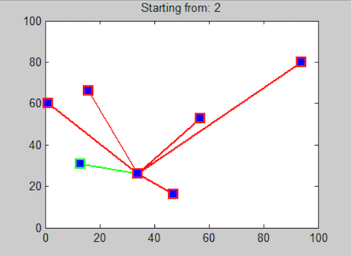
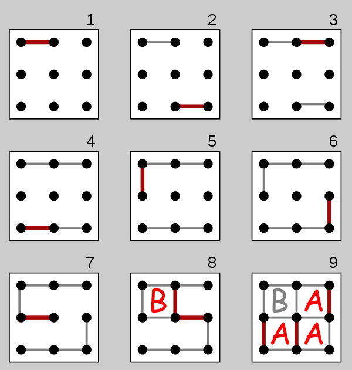
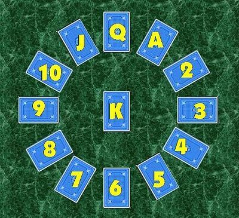
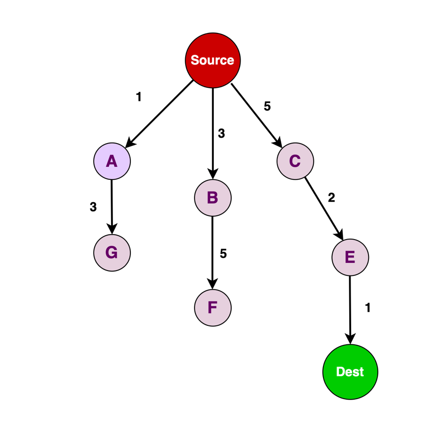

<h1 align="center">Algorithm Challenges</h1>
<p align="center">
  
</p>

## About:
- This is a collection of algorithms I have done for school assignments, online coding challenges/problems, and personal projects.
- To see and/or use most of these algorithms, you we will need Jupyter Notebook:
  ```
  pip3 install notebook
  ```

## Table of Context:

<div style="height: 20px;"></div> <!-- spacer -->

<p align="left">
  
  <div>
    <ins>C Programs</ins>
    <div>Some scripts/projects I made using the C/C++ programming language</div>
  </div>
</p>

<div style="height: 20px;"></div> <!-- spacer -->

<p align="left">
  
  <div>
    <ins>Jumping Jims Encore</ins>
    <div>My solution for an interesting graph problem. To see all the details, please view: Jumping-Jims-Encore-Problem/README.md</div>
  </div>
</p>

<div style="height: 20px;"></div> <!-- spacer -->
  
<p align="left">
  
  <div>
    <ins>Linear Partition 2 (LP2)</ins>
    <div>Both a recursive and dynamic programming solution to the following problem statement: Given a sequence S of n positive integers (s1, s2, …, sn) and an integer k, partition S into k ranges so as to maximizes the minimum sum over all ranges.</div>
  </div>
</p>

<div style="height: 20px;"></div> <!-- spacer -->

<p align="left">
  
  <div>
    <ins>Traveling Salesman Problem</ins>
    <div>Implementations of the Nearest Neighbor and Optimal_TSP (brute force permutations) algorithms for the traveling salesman problem.</div>
  </div>
</p>

<div style="height: 20px;"></div> <!-- spacer -->

<p align="left">
  
  <div>
    <ins>Website Challenges/Problems</ins>
    <div>
      <p>Algorithms I implemented for HackerRank challenges, here is my account: <a href="https://www.hackerrank.com/mehmet_mhy">mehmet_mhy</a></p>
    </div>
  </div>
</p>

<div style="height: 20px;"></div> <!-- spacer -->

<p align="left">
  
  <div>
    <ins>Dots & Boxes Analysis</ins>
    <div>Method/algorithms I created to try and analysis the game Dots & Boxes. Currently, only a 1x1 and 1x2 game has been analyzed. Read the README.md located in ./Dots_And_Boxes/ for more information.</div>
  </div>
</p>

<div style="height: 20px;"></div> <!-- spacer -->

<p align="left">
  
  <div>
    <ins>Basic Clock Solitaire</ins>
    <div>
      <p>A clock solitaire solver done though the terminal console. To learn the more about clock solitaire though this <a href="https://en.wikipedia.org/wiki/Clock_Patience">wiki</a>.</p>
    </div>
  </div>
</p>

<div style="height: 20px;"></div> <!-- spacer -->

<p align="left">
  
  <div>
    <ins>Bogo Sort Algorithm</ins>
    <div>A fun implementation of Bogo Sort. One of, if not the worst, sorting algorithms ever invented.</div>
  </div>
</p>

<div style="height: 20px;"></div> <!-- spacer -->

<p align="left">
  
  <div>
    <ins>Uniform Cost Search</ins>
    <div>Implementation of Uniform-Cost Search, please view: Uniform_Cost_search/README.md</div>
  </div>
</p>

<div style="height: 20px;"></div> <!-- spacer -->

## License Information:
- Currently this repo using the **GNU General Public License v3.0** license. This might change in the future, but for now this is the license that will be used.
- Learn More About Licenses:
  1) [GNU General Public License v3.0](https://choosealicense.com/licenses/gpl-3.0/)
  2) [Choose An Open Source License](https://choosealicense.com/)
  3) [How open source licenses work and how to add them to your projects](https://www.freecodecamp.org/news/how-open-source-licenses-work-and-how-to-add-them-to-your-projects-34310c3cf94/)
