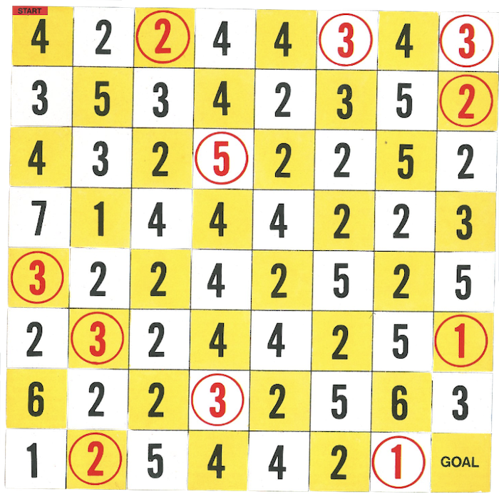
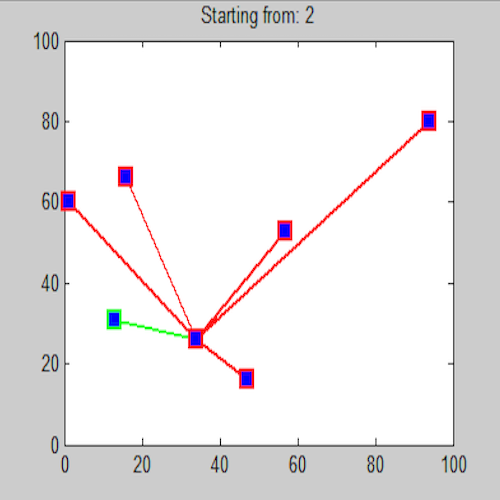
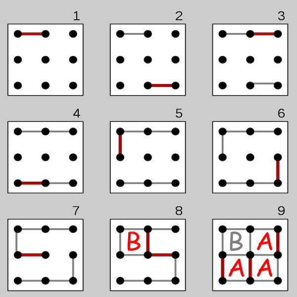
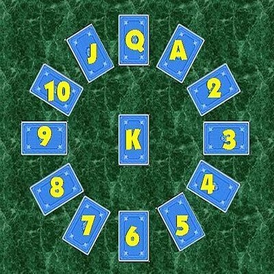
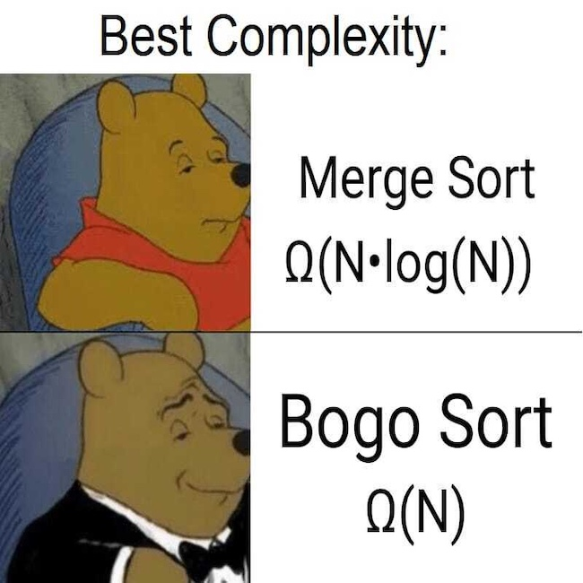
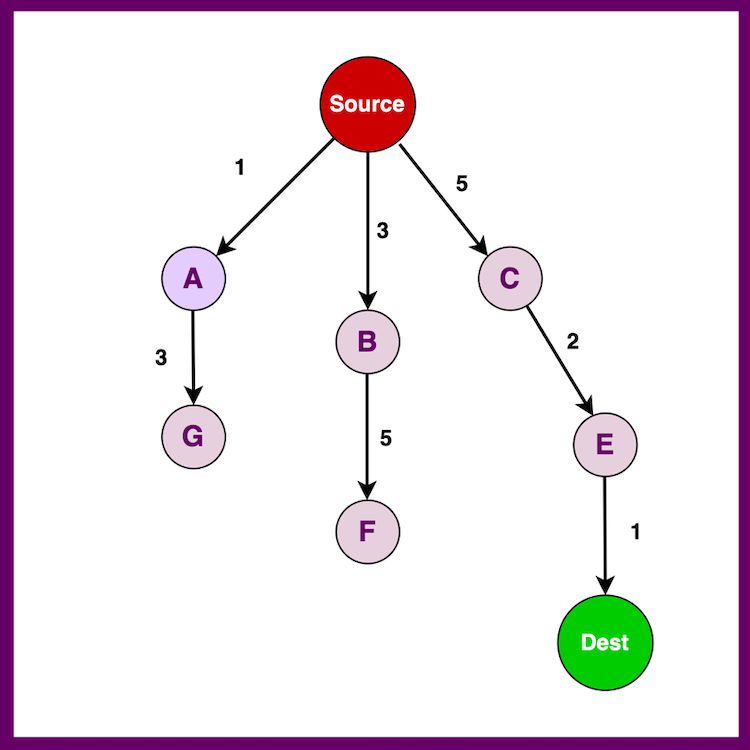

<h1 align="center">Algorithm Challenges</h1>

<p align="center">
  
</p>

## About

An assortment of academic, competitive, and/or hobbyist algorithms I've implemented over the years. To see and/or use most of these algorithms, you we will need Jupyter Notebook:

```bash
pip3 install notebook
```

## Table of Context

&nbsp;&nbsp;&nbsp;&nbsp; <!-- spacer -->

<p align="left">
  
  <div>
    <a href="./c-programs/README.md"><ins>C Programs</ins></a>
    <div>Some scripts/projects I made using the C/C++ programming language</div>
  </div>
</p>

&nbsp;&nbsp;&nbsp;&nbsp; <!-- spacer -->

<p align="left">
  
  <div>
    <a href="./csci-course-projects/README.md"><ins>CSCI Course Projects</ins></a>
    <div>Some of my early coursework from Colorado School of Mines computer science classes</div>
  </div>
</p>

&nbsp;&nbsp;&nbsp;&nbsp; <!-- spacer -->

<p align="left">
  
  <div>
    <a href="./jumping-jims-encore-problem/README.md"><ins>Jumping Jims Encore</ins></a>
    <div>My solution for an interesting graph problem. To see all the details, please view: jumping-jims-encore-problem/README.md</div>
  </div>
</p>

&nbsp;&nbsp;&nbsp;&nbsp; <!-- spacer -->

<p align="left">
  
  <div>
    <a href="./linear_partition_2/README.md"><ins>Linear Partition 2 (LP2)</ins></a>
    <div>Both a recursive and dynamic programming solution to the following problem statement: Given a sequence S of n positive integers (s1, s2, …, sn) and an integer k, partition S into k ranges so as to maximizes the minimum sum over all ranges.</div>
  </div>
</p>

&nbsp;&nbsp;&nbsp;&nbsp; <!-- spacer -->

<p align="left">
  
  <div>
    <a href="./traveling_salesman_problem/README.md"><ins>Traveling Salesman Problem</ins></a>
    <div>Implementations of the Nearest Neighbor and Optimal_TSP (brute force permutations) algorithms for the traveling salesman problem.</div>
  </div>
</p>

&nbsp;&nbsp;&nbsp;&nbsp; <!-- spacer -->

<p align="left">
  
  <div>
    <a href="./coding-challenges/README.md"><ins>Coding Challenges/Problems</ins></a>
    <div>
      <p>Algorithms I implemented for HackerRank challenges, here is my account: <a href="https://www.hackerrank.com/mehmet_mhy">mehmet_mhy</a></p>
    </div>
  </div>
</p>

&nbsp;&nbsp;&nbsp;&nbsp; <!-- spacer -->

<p align="left">
  
  <div>
    <a href="./dots+boxes/README.md"><ins>Dots & Boxes Analysis</ins></a>
    <div>Method/algorithms I created to try and analysis the game Dots & Boxes. Currently, only a 1x1 and 1x2 game has been analyzed. Read the README.md located in ./dots+boxes/ for more information.</div>
  </div>
</p>

&nbsp;&nbsp;&nbsp;&nbsp; <!-- spacer -->

<p align="left">
  
  <div>
    <a href="./basic_clock_solitaire/README.md"><ins>Basic Clock Solitaire</ins></a>
    <div>
      <p>A clock solitaire solver done though the terminal console. To learn the more about clock solitaire though this <a href="https://en.wikipedia.org/wiki/Clock_Patience">wiki</a>.</p>
    </div>
  </div>
</p>

&nbsp;&nbsp;&nbsp;&nbsp; <!-- spacer -->

<p align="left">
  
  <div>
    <a href="./bogo_sort/README.md"><ins>Bogo Sort Algorithm</ins></a>
    <div>A fun implementation of Bogo Sort. One of, if not the worst, sorting algorithms ever invented.</div>
  </div>
</p>

&nbsp;&nbsp;&nbsp;&nbsp; <!-- spacer -->

<p align="left">
  
  <div>
    <a href="./uniform_cost_search/README.md"><ins>Uniform Cost Search</ins></a>
    <div>Implementation of Uniform-Cost Search, please view: uniform_cost_search/README.md</div>
  </div>
</p>

&nbsp;&nbsp;&nbsp;&nbsp; <!-- spacer -->

<p align="left">
  
  <div>
    <a href="./web_works/README.md"><ins>Web Works</ins></a>
    <div>Notes and mini projects that revolve around Web-Development, including Sequelize examples and authentication implementations.</div>
  </div>
</p>

&nbsp;&nbsp;&nbsp;&nbsp; <!-- spacer -->

## License Information

Currently this repo using the **GNU General Public License v3.0** license. This might change in the future, but for now this is the license that will be used. Learn more about licenses with these sources: [GNU General Public License v3.0](https://choosealicense.com/licenses/gpl-3.0/), [Choose An Open Source License](https://choosealicense.com/), & [How open source licenses work and how to add them to your projects](https://www.freecodecamp.org/news/how-open-source-licenses-work-and-how-to-add-them-to-your-projects-34310c3cf94/)
